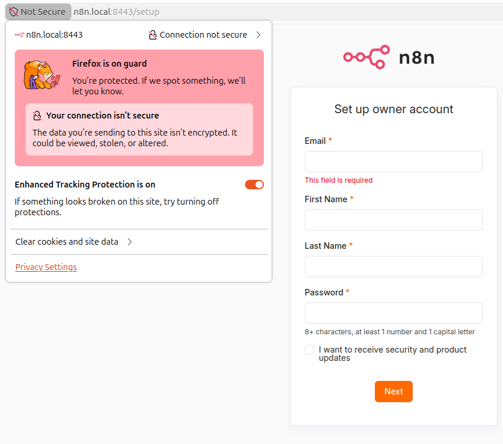

# n8n on Kubernetes (GitOps / FluxCD)

Фінальний проєкт курсу. Розгортання n8n у Kubernetes через FluxCD.
Flux сам котить зміни з цього репо в кластер, без `kubectl apply`.

База даних — PostgreSQL, піднімає оператор CloudNativePG (тобто НЕ plain
StatefulSet/Deployment, а через Custom Resource). TLS — self-signed через
cert-manager.

## Стек

- n8n — офіційний образ `n8nio/n8n`, власний helm-чарт у `charts/n8n`
- PostgreSQL — оператор CloudNativePG (CR `Cluster`)
- cert-manager — self-signed сертифікати (ClusterIssuer)
- FluxCD — GitOps
- Traefik — ingress (вбудований у k3s/Rancher Desktop)

## Структура

```
charts/n8n           власний helm-чарт (image/tag/replicas/resources/ingress/hpa)
infrastructure/      оператори (cloudnative-pg, cert-manager) + self-signed ClusterIssuer
apps/staging         ns staging: 1 репліка, мін. ресурси, PG 1 інстанс
apps/production      ns production: HPA 2-5, requests/limits, PG HA (2 інстанси)
clusters/my-cluster  точки входу Flux (Kustomizations + flux-system)
```

## Середовища

- staging: ns `staging`, 1 под, домен `n8n.staging.local`
- production: ns `production`, HPA 2-5 подів, домен `n8n.local`

## Деплой

```
export GITHUB_TOKEN=...
flux bootstrap github --owner=fortisON --repository=n8n-gitops --branch=main --path=./clusters/my-cluster --personal
```

Далі Flux сам усе підніме (оператори -> бази -> n8n). Дивитись прогрес:
`flux get kustomizations -A`.

## Доступ

У `/etc/hosts`:

```
127.0.0.1 n8n.local n8n.staging.local
```

Відкрити https://n8n.local (сертифікат self-signed, браузер лається — це норм).

## Перевірка

`flux get helmreleases -A` — усі релізи Ready:

```
NAMESPACE     NAME            REVISION   SUSPENDED   READY   MESSAGE
flux-system   cert-manager    v1.20.2    False       True    Helm install succeeded for release cert-manager/cert-manager.v1
flux-system   cloudnative-pg  0.28.2     False       True    Helm install succeeded for release cnpg-system/cloudnative-pg.v1
production    n8n             0.1.0      False       True    Helm install succeeded for release production/n8n.v1
staging       n8n             0.1.0      False       True    Helm install succeeded for release staging/n8n.v1
```

`flux get kustomizations -A` — обидва середовища синхронізовані:

```
NAMESPACE     NAME                REVISION             SUSPENDED   READY   MESSAGE
flux-system   apps-production     main@sha1:9df5c0f2   False       True    Applied revision: main@sha1:9df5c0f2
flux-system   apps-staging        main@sha1:9df5c0f2   False       True    Applied revision: main@sha1:9df5c0f2
flux-system   flux-system         main@sha1:9df5c0f2   False       True    Applied revision: main@sha1:9df5c0f2
flux-system   infra-configs       main@sha1:9df5c0f2   False       True    Applied revision: main@sha1:9df5c0f2
flux-system   infra-controllers   main@sha1:9df5c0f2   False       True    Applied revision: main@sha1:9df5c0f2
```

`kubectl get pods -A` — поди в обох неймспейсах (kube-system/default опущено):

```
NAMESPACE      NAME                                       READY   STATUS    RESTARTS   AGE
cert-manager   cert-manager-56949cd87b-9c99d              1/1     Running   0          14m
cert-manager   cert-manager-cainjector-74c7bcf57c-g8xpl   1/1     Running   0          14m
cert-manager   cert-manager-webhook-69bdf957c6-w8nxj      1/1     Running   0          14m
cnpg-system    cloudnative-pg-77887754b5-ms9nd            1/1     Running   0          14m
flux-system    helm-controller-678fc574b-ftmm8            1/1     Running   0          15m
flux-system    kustomize-controller-54cd597856-5phs6      1/1     Running   0          15m
flux-system    notification-controller-57f99647f5-4nw5w   1/1     Running   0          15m
flux-system    source-controller-5f9c5996b6-zhpzz         1/1     Running   0          15m
production     n8n-6bcbb99cf5-29rq7                       1/1     Running   0          2m55s
production     n8n-6bcbb99cf5-hdct2                       1/1     Running   0          3m8s
production     n8n-6bcbb99cf5-mr2pb                       1/1     Running   0          2m45s
production     n8n-6bcbb99cf5-tghjt                       1/1     Running   0          2m46s
production     n8n-6bcbb99cf5-xtjlb                       1/1     Running   0          3m
production     n8n-db-1                                   1/1     Running   0          4m
production     n8n-db-2                                   1/1     Running   0          3m31s
staging        n8n-5f4fb99db6-bqx8v                       1/1     Running   1          14m
staging        n8n-db-1                                   1/1     Running   0          13m
```

`kubectl get ingress -A`:

```
NAMESPACE    NAME   CLASS     HOSTS               ADDRESS        PORTS     AGE
production   n8n    traefik   n8n.local           192.168.5.15   80, 443   4m
staging      n8n    traefik   n8n.staging.local   192.168.5.15   80, 443   14m
```

HPA та бази у production (`kubectl get hpa,cluster -n production`):

```
NAME   REFERENCE        TARGETS       MINPODS   MAXPODS   REPLICAS   AGE
n8n    Deployment/n8n   cpu: 2%/70%   2         5         5          4m

NAME     INSTANCES   READY   STATUS                     PRIMARY
n8n-db   2           2       Cluster in healthy state   n8n-db-1
```

Self-Healing — видаляємо Deployment вручну, Flux (helm-controller) повертає його:

```
$ kubectl delete deploy n8n -n production
deployment.apps "n8n" deleted

$ flux reconcile helmrelease n8n -n production --force
✔ applied revision 0.1.0

$ kubectl get deploy n8n -n production
NAME   READY   UP-TO-DATE   AVAILABLE   AGE
n8n    2/2     2            2           37s
```



(Deployment керує HelmRelease, тому self-healing йде через реконсиляцію HelmRelease,
а не Kustomization; helm-controller також сам виправляє дрейф протягом ≤10 хв.)

## Нотатки

- Ключ шифрування n8n лежить у репо відкритим — лише для стенда, не для прод.
- Пароль до PostgreSQL генерує сам оператор (secret `n8n-db-app`), у git його нема.
- Образ не білдимо, тому CI у `.github/workflows` лише валідує маніфести.
